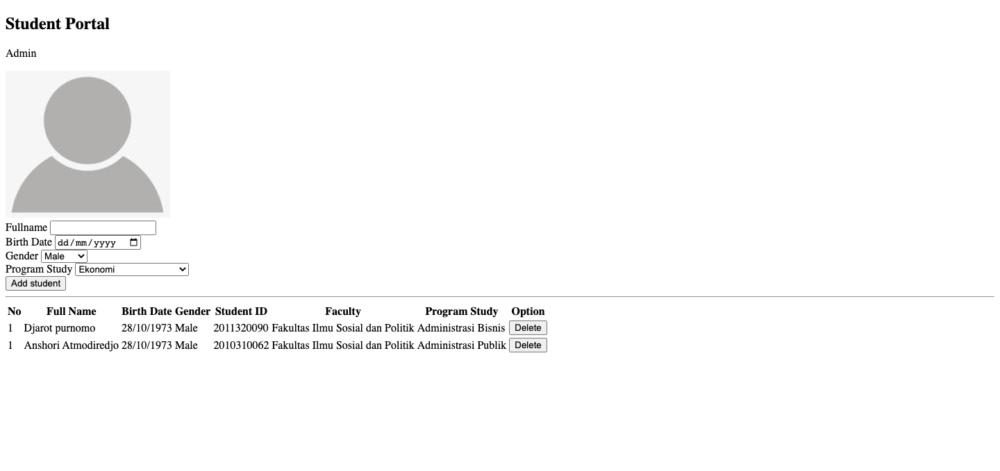

# Student Portal - Admin Page

## Assignment

### Objectives

-   Dapat menggunakan Tag HTML sederhana untuk membuat _website_.
-   Dapat membuat _form_ untuk mengirim data.
-   Dapat membuat _table_ untuk menampilkan data.

### Restrictions

-   _Assignment_ ini tidak perlu membuat `style CSS`.
-   Dilarang menyalin _code_ HTML yang ada di internet, harus membuat dari awal.

### Description

Pada _Assignment_ kali ini kalian diminta untuk membuat sebuah halaman admin untuk _Student Portal_, dimana pada halaman tersebut terdapat `form` untuk menambahkan data _student_ serta `table` untuk menampilkan & menghapus data _student_ yang sudah terdaftar dengan ketentuan berikut:

1. **Form**

    - Memiliki `id` berupa `form-student`
    - Memiliki 4 buah label berupa `Fullname`, `Birth Date`, `Gender`, dan `Program Study`
    - `Fullname` : menggunakan `input` dengan `type` `text` dan `id` berupa `input-name`
    - `Birth Date` : menggunakan `input` dengan `type` `date` dan `id` berupa `input-date`
    - `Gender` : menggunakan `select` dan memiliki `id` berupa `input-gender`. `Gender` memiliki `option` berupa :
        - `Male`
        - `Female`
    - `Program Study` : menggunakan `select` dan memiliki `id` berupa `input-prody`. `Program Study` memiliki `option` berupa :
        - `Ekonomi`
        - `Manajemen`
        - `Akuntansi`
        - `Administrasi Publik`
        - `Administrasi Bisnis`
        - `Hubungan Internasional`
        - `Teknik Sipil`
        - `Arsitektur`
        - `Matematika`
        - `Fisika`
        - `Informatika`
    - _Button form_ `Add student`: menggunakan `input` dengan `type` `submit`, `value` `Add student` dan `id` berupa `add-btn`

2. **Table**

    - Memiliki `id` berupa `table-student`
    - Pada bagian _head_ terdapat beberapa elemen `th` berupa `No`, `Full Name`, `Birth Date`, `Gender`, `Student ID`, `Faculty`, `Program Study`, dan `Option`.
    - Memiliki `id` berupa `student-data` untuk elemen `tbody`.
    - Buatlah _dummy data_ (**min. 1**) pada bagian _body_.
    - Untuk _delete button_ pada bagian `Option` berupa tag html `button` dengan `type` `button` dan `class` berupa `delete-btn`

### Workspace

Pengerjaan dilakukan pada file `index.html`

Berikut contoh halaman _web_ dari _Student Portal_ yang perlu kalian buat:

