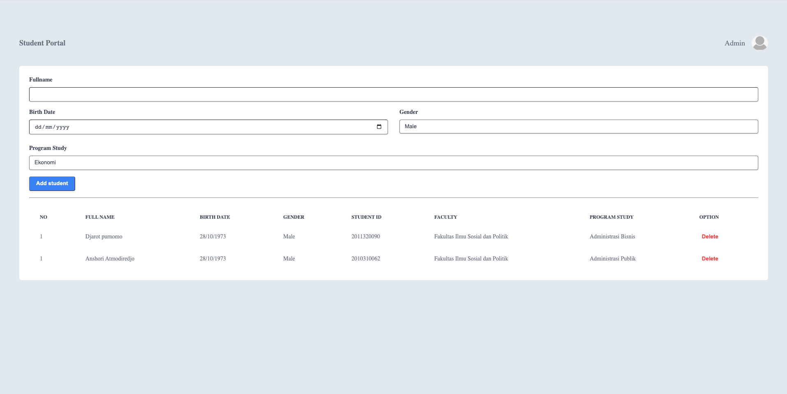

# Student Portal - Admin Page

## Assignment

### Objectives

-   Memiliki kemampuan dalam mendesign halaman web menggunakan CSS.
-   Mampu menggunakan Grid.
-   Mampu menggunakan Flexbox.

### Restrictions

-   Wajib mengerjakan _Styling_ CSS pada _file_ terpisah dengan _file_ HTML (`style.css`).
-   Tidak boleh menggunakan CSS Framework apapun (Tailwind, Bootstrap dll).

### Acceptance criteria

-   Menggunakan CSS dalam proses _styling_ dokumen HTML.
-   Minimal memiliki 1 (satu) komponen yang menggunakan _Grid_.
-   Memiliki _grid template columns_ dan/atau _grid template rows_ untuk pengaturan jumlah _template grid_.
-   Memiliki _grid gap_ untuk pengaturan jarak antar _grid_.
-   Minimal memiliki 1 (satu) komponen yang menggunakan _Flexbox_.
-   Memiliki pengaturan untuk _distribution of space_ dalam _flex container_ baik secara _horizontal_ maupun _vertical_.

### Directions

_Copy_/salin isi file `index.html` dan buatlah halaman web yang sudah kalian kerjakan pada assignment sebelumnya sebagus dan secantik mungkin menggunakan CSS. Buatlah _styling_ CSS pada _file_ yang terpisah dengan _file_ HTML kalian (`style.css`). Tampilan halaman web dibebaskan, namun dalam proses pembuatannya kalian diwajibkan menggunakan **Grid** dan **Flexbox system** dalam penataan setiap elemennya (_layouting_).

### Workspace

Pengerjaan dilakukan pada file `index.html` dan `style.css`.

Berikut contoh halaman web yang perlu kalian buat:

