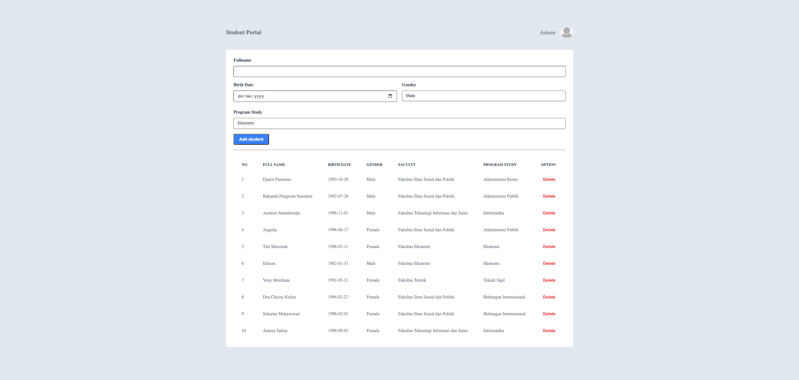

# Student Portal - Student Portal with React

## Assignment

### NOTES

-   Pada skeleton kode yang terdapat file `main.test.js` tidak boleh diubah sama sekali.
-   Dilarang mengganti nama function yang diberikan.
-   Wajib menjalankan `npm install` atau `pnpm install` sebelum mengerjakan project.
-   Kerjakan pada file `App.js`, `Form.jsx` dan `Table.jsx`

### Description

Pada assignment ini kalian diminta untuk membuat sebuah halaman _web_ _Student Portal_. Terdapat beberapa file _component_ yang sudah di sediakan pada folder `./src/components` dengan penamaan sesuai fungsinya, antara lain:

-   `Form` : Digunakan untuk me-_render_ _component_ _Form_.
-   `Table` : Digunakan untuk me-_render_ _component_ _Table_.

Buatlah masing-masing _component_ lalu _import_ dan gunakan seluruh _component_ pada file `./src/App.js`. Berikut penjelasan dari setiap _component_.

#### `App.js`

Pada file ini kalian disediakan sebuah variable _students_ berupa _Array of Objects_

```js
const students = [
        {
            id: 1,
            fullname: "Djarot Purnomo",
            birthDate: "1993-10-28",
            gender: "Male",
            faculty: "Fakultas Ilmu Sosial dan Politik",
            programStudy: "Administrasi Bisnis",
        },
        {
            id: 2,
            fullname: "Rakanda Pangeran Nasution",
            birthDate: "1992-07-26",
            gender: "Male",
            faculty: "Fakultas Ilmu Sosial dan Politik",
            programStudy: "Administrasi Publik",
        },
        {
            id: 3,
            fullname: "Anshori Atmodiredjo",
            birthDate: "1996-11-01",
            gender: "Male",
            faculty: "Fakultas Teknologi Informasi dan Sains",
            programStudy: "Informatika",
        },
        ...
    ];
```

Selain itu kalian juga diminta melakukan beberapa hal, antara lain:

1. Melakukan _import_ serta menggunakan 2 _component_ lainnya berupa `Form` dan `Table`
2. Melempar data _students_ pada _component_ `Table` sebagai _props_.

#### `Form.jsx`

_Component_ ini di gunakan untuk merender sebuah _Form_. Pada bagian ini yang perlu kalian lakukan adalah membuat sebuah _Form_ dengan **_minimum requirement_** sebagai berikut:

1. Memiliki _attribute_ `id` dengan _value_ `form-student`
2. Memiliki 4 buah label berupa `Fullname`, `Birth Date`, `Gender`, dan `Program Study`
    - `Fullname` : menggunakan `input` dengan `type` `text` dan `id` berupa `input-name`
    - `Birth Date` : menggunakan `input` dengan `type` `date` dan `id` berupa `input-date`
    - `Gender` : menggunakan `select` dan memiliki `id` berupa `input-gender`. `Gender` memiliki `option` berupa :
        - `Male`
        - `Female`
    - `Program Study` : menggunakan `select` dan memiliki `id` berupa `input-prody`. `Program Study` memiliki `option` berupa :
        - `Ekonomi`
        - `Manajemen`
        - `Akuntansi`
        - `Administrasi Publik`
        - `Administrasi Bisnis`
        - `Hubungan Internasional`
        - `Teknik Sipil`
        - `Arsitektur`
        - `Matematika`
        - `Fisika`
        - `Informatika`
3. _Button form_ `Add student`: menggunakan `input` dengan `type` `submit`, `value` `Add student` dan `id` berupa `add-btn`

#### `Table.jsx`

_Component_ ini di gunakan untuk me-_render_ sebuah _Table_. Pada _component_ ini terdapat sebuah function `Table` yang menerima _props_ dengan format sebagai berikut:

| Name           | Data Type |
| -------------- | --------- |
| _fullname_     | string    |
| _birthDate_    | string    |
| _gender_       | string    |
| _faculty_      | string    |
| _programStudy_ | string    |

Pada bagian ini yang perlu kalian lakukan adalah membuat sebuah _Table_ dan menampilkan data `props` yang dilempar dari file `App.js` dengan **_minimum requirement_** sebagai berikut:

1. Memiliki _attribute_ `id` dengan _value_ `table-student`
2. Pada bagian _head_ terdapat beberapa elemen `th` berupa `No`, `Full Name`, `Birth Date`, `Gender`, `Faculty`, `Program Study`, dan `Option`.
3. Menampilkan seluruh data _students_ pada _props_ (`Full Name`, `Birth Date`, `Gender`, `Faculty`, `Program Study`, dan `Option`).

### Preview

Berikut contoh dari halaman _Student Portal_ yang perlu di buat (Tambahan _element_ lainnya bersifat **_optional_**)



> Silahkan lakukan styling dengan kreatifitas yang kalian miliki.
