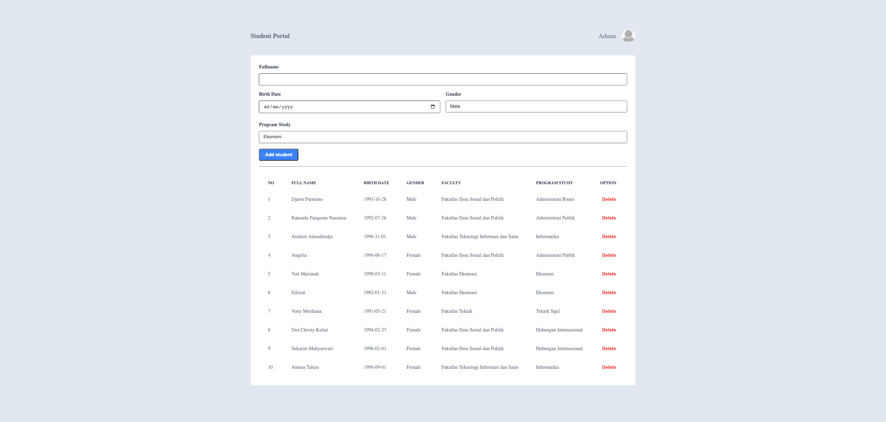

# Student Portal - Student Portal with React

## Assignment

### NOTES

-   Pada skeleton kode yang terdapat file `main.test.js` tidak boleh diubah sama sekali.
-   Dilarang mengganti nama function yang diberikan.
-   Wajib menjalankan `npm install` atau `pnpm install` sebelum mengerjakan project.
-   Kerjakan pada file `App.js`, `Form.jsx` dan `Table.jsx`

### Description

Pada assignment ini kalian diminta untuk melanjutkan pembuatan sebuah halaman _web_ _Student Portal_ (**Gunakanlah kode yang sudah dibuat di _assignment_ sebelumnya**). Yang perlu kalian lakukan adalah menambahkan beberapa fitur pada halaman _web_ _Student Portal_ kalian, antara lain:

-   Mengaktifkan _form_ dan membuat fitur _Add Student_.
-   Mengaktifkan _button Delete Student_.

Kalian diberikan juga sebuah file `json-server` dengan nama `students-db.json` dalam folder `/server` sebagai _server_ kalian.

> Server dapat di jalankan menggunakan command `npm run start:server` dan akan berjalan pada `http://localhost:3001/`.

Berikut ini beberapa endpoint dari `json-server` yang dapat kalian akses:

```
GET /student
DELETE /student/id
```

#### `App.js`

Pada file ini kalian diminta untuk melakukan beberapa hal, antara lain:

1. Melakukan _fetch_ data dari `json-server`, dimana data yang terdapat pada `json-server` merupakan data _students_ yang akan kalian tampilkan pada halaman _web_ _Student Portal_ kalian. Data akan langsung ditampilkan setiap kali halaman di _render_.

2. Jika data belum ada maka akan menampilkan pesan "**Loading ...**" dalam elemen `p`, namun jika data yang diterima sudah ada maka akan dilempar ke dalam _custom component_ `Table` sebagai `props` yang sebelumnya perlu kalian _import_.

#### `Form.jsx`

Pada _component_ ini kalian diminta untuk mengaktifkan _form_ yang sudah di buat pada _assignment_ sebelumnya dan membuat fitur _add student_ dengan ketentuan berikut:

1. Terdapat beberapa hal yang perlu kalian tambahkan pada setiap `input`/`select` _form_ kalian, antara lain:

    - `Fullname` : memiliki _attribute_ `data-testid` dengan _value_ `name`.
    - `Birth Date` : memiliki _attribute_ `data-testid` dengan _value_ `date`.
    - `Gender` : memiliki _attribute_ `data-testid` dengan _value_ `gender`.
    - `Program Study` : memiliki _attribute_ `data-testid` dengan _value_ `prody`.
    - _Button form_ `Add student`: memiliki _attribute_ `data-testid` dengan _value_ `submit`.

2. Terdapat beberapa _field_ data yang di _submit_ lalu di tambahkan kedalam `json-server`.

    | Name           | Data Type |
    | -------------- | --------- |
    | _fullname_     | string    |
    | _birthDate_    | string    |
    | _gender_       | string    |
    | _faculty_      | string    |
    | _programStudy_ | string    |

3. Membuat _conditional_ untuk meng-_handle_ data `faculty` yang akan di kirim melalui `body` berdasarkan data `programStudy` yang di-_input_ oleh student dengan ketentuan berikut ini:

    | Faculty                                | Program Study          |
    | -------------------------------------- | ---------------------- |
    | Fakultas Ekonomi                       | Ekonomi                |
    |                                        | Manajemen              |
    |                                        | Akuntansi              |
    | Fakultas Ilmu Sosial dan Politik       | Administrasi Publik    |
    |                                        | Administrasi Bisnis    |
    |                                        | Hubungan Internasional |
    | Fakultas Teknik                        | Teknik Sipil           |
    |                                        | Arsitektur             |
    | Fakultas Teknologi Informasi dan Sains | Matematika             |
    |                                        | Fisika                 |
    |                                        | Informatika            |

    Sehingga jika _student_ memilih _program study_ tertentu maka secara otomatis sistem akan memilihkan fakultas yang memiliki _program study_ tersebut.

    > Contoh: Afista memilih program study Arsitektur, maka ketika di submit Afista akan secara otomatis terdaftar pada Fakultas Teknik.

4. Setiap kali _form_ di _submit_ maka secara otomatis akan melakukan **_CREATE_** data dan data _student_ terbaru akan langsung ditampilkan pada _table_.

#### `Table.jsx`

Pada _component_ ini kalian diminta untuk menampilkan data yang dilempar melalui _props_ dan mengaktifkan _button Delete Student_ yang sudah di buat pada _assignment_ sebelumnya dengan ketentuan berikut:

1. Elemen `tr` pada `tbody` memiliki _attribute_ `className` dengan _value_ `student-data-row`.

2. _Button Delete Student_ merupakan sebuah element button yang memiliki attribute `data-testid` dengan value `delete-<student id>` (sesuai id yang dimiliki masing-masing _student_).

    > Misal: student dengan id 5 maka pada button delete akan memiliki attribute `data-testid` dengan value `delete-5`.

3. Setiap kali _button delete_ di klik maka akan otomatis menghapus data _student_ tersebut pada `json-server` dan data _student_ tersebut akan dihilangkan pada tampilkan web (tanpa perlu _refresh_ halaman).

### Preview

Berikut contoh dari halaman _Student Portal_ yang perlu di buat (Tambahan _element_ lainnya bersifat **_optional_**)


klik gambar untuk melihat video, atau klik [disini](https://youtu.be/bE5AbX7PEuc)

> Silahkan lakukan styling dengan kreatifitas yang kalian miliki.
