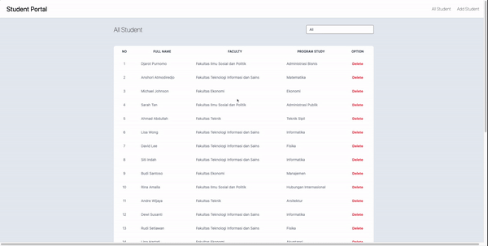
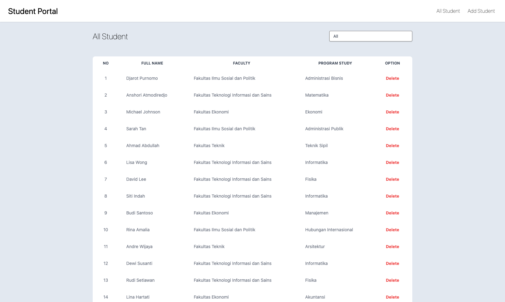
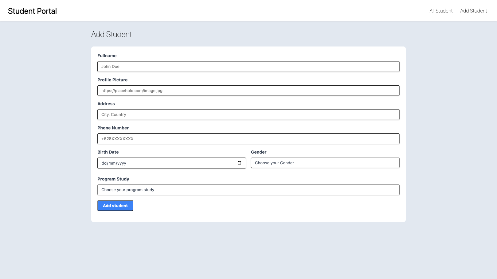
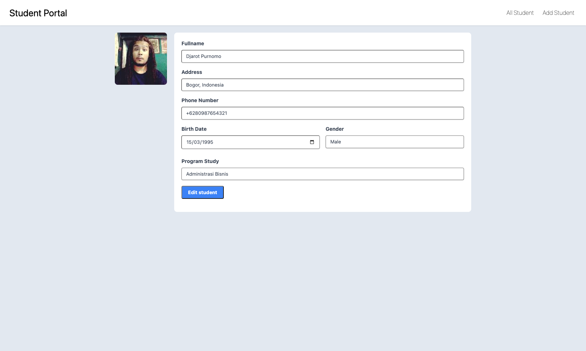
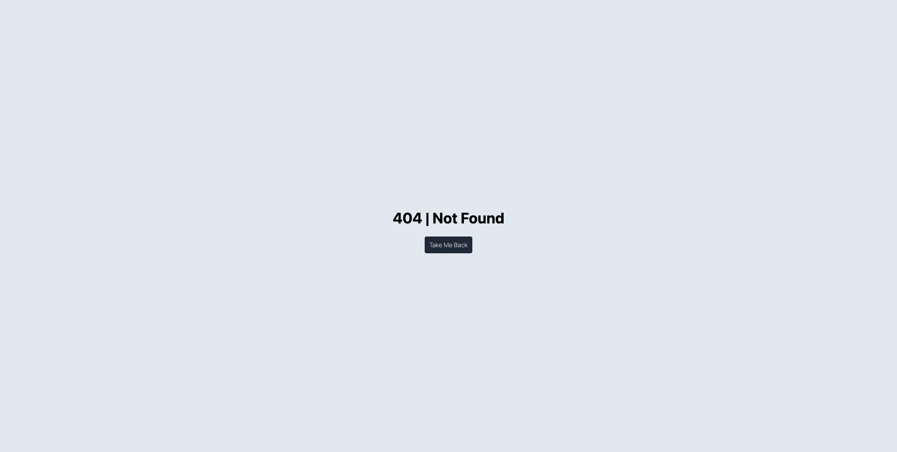

# Student Portal - Student Portal with React

## Final Project

### NOTES

-   Pada skeleton kode yang terdapat file `main.test.js` tidak boleh diubah sama sekali.
-   Dilarang mengganti nama function yang diberikan.
-   Wajib menjalankan `npm install` atau `pnpm install` sebelum mengerjakan project.
-   Kerjakan pada file `App.js`, `Navbar.jsx`, `Home.jsx`, `Student.jsx`, `AddStudent.jsx`, `EditStudent.jsx` dan `NotFound.jsx`

### Description

Pada assignment ini kalian diminta untuk melanjutkan pembuatan sebuah halaman _web_ _Student Portal_ (**Diperbolehkan menggunakan kode yang sudah dibuat di _assignment_ sebelumnya**). Yang perlu kalian lakukan adalah menambahkan beberapa fitur pada halaman _web_ _Student Portal_ kalian, antara lain:

-   Membuat halaman _Home_.
-   Membuat halaman untuk menampilkan seluruh data _student_.
-   Membuat fitur _filter_ data _student_ berdasarkan fakultas yang dimiliki.
-   Membuat halaman untuk menambahkan data _student_.
-   Membuat halaman untuk meng-_edit_ data _student_.
-   Membuat halaman untuk merender komponen "**Page not found**".
-   Membuat _navigation bar_ untuk melakukan perpindahan halaman.

Kalian diberikan juga sebuah file `json-server` dengan nama `students-db.json` dalam folder `/server` sebagai _server_ kalian.

> Server dapat di jalankan menggunakan command `npm run start:server` dan akan berjalan pada `http://localhost:3001/`.

Berikut ini beberapa endpoint dari `json-server` yang dapat kalian akses:

```
GET /student
GET /student/id
PUT /student/id
DELETE /student/id
```

#### `App.js`

Pada file ini, kalian diminta untuk membuat `Routes` untuk aplikasi ini, berikut ketentuannya:

-   `Route` dengan path "`/`" yang akan merender komponen `Home`.
-   `Route` dengan path "`/add`" yang akan merender komponen `AddStudent`.
-   `Route` dengan path "`/student`" yang akan merender komponen `Student`.
-   `Route` dengan path "`/student/:id`" yang akan merender komponen `EditStudent`.
-   Buatlah `Route` yang akan merender komponen "**Page not found**", yang akan di tampilkan jika user memasukan url yang tidak kita handle.

#### `Home.jsx`

Pada _component_ ini kalian diminta untuk membuat sebuah halaman _Home_ dari _web_ _Student Portal_. Buatlah sebuah `button` _All Student_ yang memiliki _attribute_ `data-testid` dengan _value_ `student-btn` yang mana ketika button tersebut di klik maka akan berpindah ke halaman `/student` (_Student_).


> Silahkan lakukan styling dengan kreatifitas yang kalian miliki.

#### `Navbar.jsx`

Pada _component_ ini kalian diminta untuk membuat sebuah _Navigation Bar_ dari _web_ _Student Portal_ dengan ketentuan berikut:

1. Terdapat judul _web_ "Student Portal" yang memiliki _attribute_ `data-testid` dengan _value_ `home-page` dan jika di klik akan berpindah ke halaman `/` (_Home_).
2. Terdapat _button_/_link_ "All Student" yang memiliki _attribute_ `data-testid` dengan _value_ `student-page` dan jika di klik akan berpindah ke halaman `/student` (_Student_).
3. Terdapat _button_/_link_ "Add Student" yang memiliki _attribute_ `data-testid` dengan _value_ `add-page` dan jika di klik akan berpindah ke halaman `/add` (Add _Student_).

Tambahkan navigation bar yang sudah di buat pada halaman _Student_, _Add Student_ dan _Edit Student_.


> Silahkan lakukan styling dengan kreatifitas yang kalian miliki.

#### `Student.jsx`

Pada _component_ ini kalian diminta untuk melakukan beberapa hal, antara lain:

1. Melakukan _fetch_ data dari `json-server`, dimana data yang terdapat pada `json-server` merupakan data _students_ yang akan kalian tampilkan pada halaman _web_ _Student Portal_ kalian. Data akan langsung ditampilkan setiap kali halaman di _render_.

2. Jika data belum ada maka akan menampilkan pesan "**Loading ...**" dalam elemen `p`, namun jika data yang diterima sudah ada maka akan menampilkan tabel data student.

3. Menampilkan data student pada sebuah _table_ dengan **_minimum requirement_** sebagai berikut:

    - Memiliki _attribute_ `id` dengan _value_ `table-student`
    - Elemen `tr` pada `tbody` memiliki _attribute_ `className` dengan _value_ `student-data-row`
    - Pada bagian _head_ terdapat beberapa elemen `th` berupa `No`, `Full Name`, `Faculty`, `Program Study`, dan `Option`.
    - Menampilkan sebagian data _students_ (`Full Name`, `Faculty`, `Program Study`, dan `Option`).
    - Terdapat _button Delete_ yang memiliki attribute `data-testid` dengan value `delete-<student id>` (sesuai id yang dimiliki masing-masing _student_).
        > Misal: student dengan id 5 maka pada button delete akan memiliki attribute `data-testid` dengan value `delete-5`.
    - Setiap kali _button delete_ di klik maka akan otomatis menghapus data _student_ tersebut pada `json-server` dan data _student_ tersebut akan dihilangkan pada tampilkan web (tanpa perlu _refresh_ halaman).
    - Jika nama student di klik akan langsung berpindah ke halaman `/student/:id` (_Edit Student_).

        

4. Membuat fitur _filter_ data berdasarkan fakultas yang dimiliki dengan ketentuan berikut:

    - Elemen _filter_ dibuat menggunakan elemen `select`
    - Memiliki _attribute_ `data-testid` dengan _value_ `filter`
    - Terdapat **5 _options_** berupa `All`, dan 4 nama fakultas lainnya.
    - _Option_ `All` memiliki _value_ `All` dan akan menampilkan seluruh data.
    - _Option_ `Fakultas Ekonomi` memiliki _value_ `Fakultas Ekonomi` dan akan melakukan _filter_ yang akan menampilkan seluruh data dari `Fakultas Ekonomi`.
    - _Option_ `Fakultas Ilmu Sosial dan Politik` memiliki _value_ `Fakultas Ilmu Sosial dan Politik` dan akan melakukan _filter_ yang akan menampilkan seluruh data dari `Fakultas Ilmu Sosial dan Politik`.
    - _Option_ `Fakultas Teknik` memiliki _value_ `Fakultas Teknik` dan akan melakukan _filter_ yang akan menampilkan seluruh data dari `Fakultas Teknik`.
    - _Option_ `Fakultas Teknologi Informasi dan Sains` memiliki _value_ `Fakultas Teknologi Informasi dan Sains` dan akan melakukan _filter_ yang akan menampilkan seluruh data dari `Fakultas Teknologi Informasi dan Sains`.



> Silahkan lakukan styling dengan kreatifitas yang kalian miliki.

#### `AddStudent.jsx`

Pada _component_ ini kalian diminta untuk membuat _form_ seperti yang sudah di buat pada _assignment_ sebelumnya dengan beberapa tambahan ketentuan berikut:

1. Terdapat beberapa hal yang perlu kalian tambahkan pada setiap `input`/`select` _form_ kalian, antara lain:

    - `Fullname` : memiliki _attribute_ `data-testid` dengan _value_ `name`.
    - `Profile Picture` : memiliki _attribute_ `data-testid` dengan _value_ `profilePicture`.
    - `Address` : memiliki _attribute_ `data-testid` dengan _value_ `address`.
    - `Phone Number` : memiliki _attribute_ `data-testid` dengan _value_ `phoneNumber`.
    - `Birth Date` : memiliki _attribute_ `data-testid` dengan _value_ `date`.
    - `Gender` : memiliki _attribute_ `data-testid` dengan _value_ `gender`.
    - `Program Study` : memiliki _attribute_ `data-testid` dengan _value_ `prody`.
    - _Button form_ `Add student`: memiliki _attribute_ `data-testid` dengan _value_ `add-btn`.

2. Terdapat beberapa _field_ data yang di _submit_ lalu di tambahkan kedalam `json-server`.

    | Name             | Data Type |
    | ---------------- | --------- |
    | _fullname_       | string    |
    | _profilePicture_ | string    |
    | _address_        | string    |
    | _phoneNumber_    | string    |
    | _birthDate_      | string    |
    | _gender_         | string    |
    | _faculty_        | string    |
    | _programStudy_   | string    |

3. Membuat _conditional_ untuk meng-_handle_ data `faculty` yang akan di kirim melalui `body` berdasarkan data `programStudy` yang di-_input_ oleh student dengan ketentuan berikut ini:

    | Faculty                                | Program Study          |
    | -------------------------------------- | ---------------------- |
    | Fakultas Ekonomi                       | Ekonomi                |
    |                                        | Manajemen              |
    |                                        | Akuntansi              |
    | Fakultas Ilmu Sosial dan Politik       | Administrasi Publik    |
    |                                        | Administrasi Bisnis    |
    |                                        | Hubungan Internasional |
    | Fakultas Teknik                        | Teknik Sipil           |
    |                                        | Arsitektur             |
    | Fakultas Teknologi Informasi dan Sains | Matematika             |
    |                                        | Fisika                 |
    |                                        | Informatika            |

    Sehingga jika _student_ memilih _program study_ tertentu maka secara otomatis sistem akan memilihkan fakultas yang memiliki _program study_ tersebut.

    > Contoh: Afista memilih program study Arsitektur, maka ketika di submit Afista akan secara otomatis terdaftar pada Fakultas Teknik.

4. Setiap kali _form_ di _submit_ maka secara otomatis akan melakukan **_CREATE_** data, halaman akan berpindah ke `/student` (_Student_) dan data _student_ terbaru akan langsung ditampilkan pada _table_.



> Silahkan lakukan styling dengan kreatifitas yang kalian miliki.

#### `EditStudent.jsx`

Pada _component_ ini kalian diminta untuk membuat _form_ dengan spesifikasi seperti _form_ _Add Student_ dengan beberapa tambahan ketentuan berikut:

1. Setiap kali halaman _Edit Student_ di _render_, maka akan melakukan _fetch_ data student berdasarkan `id` nya. Jika data belum ada maka akan menampilkan pesan "**Loading ...**" dalam elemen `p`, namun jika data yang diterima sudah ada maka akan menampilkan gambar sekaligus form yang sudah berisi data student yang akan di edit.

    

2. _Form edit_ tidak memiliki input untuk _edit_ `profilePicture` milik _student_, namun `profilePicture` ditampilkan menggunakan tag html `img`.

3. _Button form_ `Edit student`: memiliki _attribute_ `data-testid` dengan _value_ `edit-btn`.

4. Setiap kali _form_ di _submit_ maka secara otomatis akan melakukan **_PUT_** data, halaman akan berpindah ke `/student` (_Student_) dan data _student_ terbaru akan langsung ditampilkan pada _table_.



> Silahkan lakukan styling dengan kreatifitas yang kalian miliki.

#### `NotFound.jsx`

Pada _component_ ini kalian diminta untuk membuat komponen "**Page not found**", yang akan di tampilkan jika user memasukan url yang tidak kita handle dengan ketentuan berikut:

1. Terdapat pesan "**404 | Not Found**".

2. Terdapat _button_ yang memiliki _attribute_ `data-testid` dengan _value_ `back` yang mana jika di klik akan mengembalikan **ke halaman sebelumnya**.



> Silahkan lakukan styling dengan kreatifitas yang kalian miliki.
