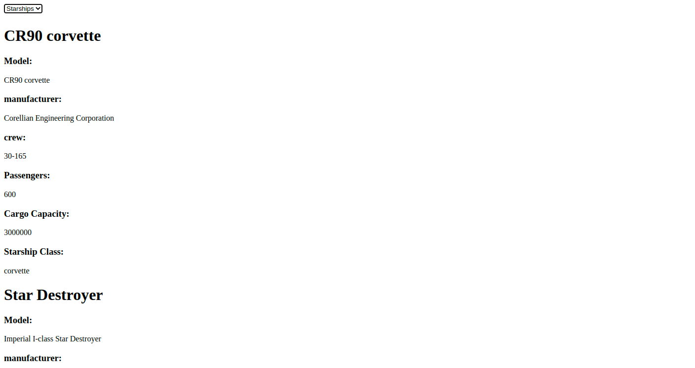

# useEffect and Data Fetching

### NOTES

-   Pada skeleton kode yang terdapat file `main.test.js` tidak boleh diubah sama sekali.
-   Dilarang mengganti nama function yang diberikan.
-   Wajib menjalankan `npm install` atau `pnpm install` sebelum mengerjakan final project.

### Description

**Star Wars App** merupakan sebuah web sederhana untuk menampilkan beberapa data terkait film **Star Wars**. Kalian diminta untuk mengerjakan pada file `App.js`, `People.jsx`, `Planets.jsx`, dan `Starship.jsx` dan melakukan _fetch_ data dari sebuah _3rd party API_ yang sudah disediakan dimana secara _default_ ketika halaman di _render_ maka akan menampilkan data `People`. Berikut beberapa kriterianya, yaitu:

-   Jika data `People` yang di tampilkan:

        ```txt
        https://swapi.py4e.com/api/people
        ```

    Contoh result dari _3rd party API_ di atas berupa JSON dengan format:

        ```json
        {
            count: 82,
            next: "https://swapi.dev/api/people/?page=2",
            previous: null,
            results: [
                {
                    name: "Luke Skywalker",
                    height: "172",
                    mass: "77",
                    hair_color: "blond",
                    skin_color: "fair",
                    eye_color: "blue",
                    birth_year: "19BBY",
                    gender: "male",
                    homeworld: "https://swapi.dev/api/planets/1/",
                    films: [
                        "https://swapi.dev/api/films/1/",
                        "https://swapi.dev/api/films/2/",
                        "https://swapi.dev/api/films/3/",
                        "https://swapi.dev/api/films/6/",
                    ],
                    species: [],
                    vehicles: [
                        "https://swapi.dev/api/vehicles/14/",
                        "https://swapi.dev/api/vehicles/30/",
                    ],
                    starships: [
                        "https://swapi.dev/api/starships/12/",
                        "https://swapi.dev/api/starships/22/",
                    ],
                    created: "2014-12-09T13:50:51.644000Z",
                    edited: "2014-12-20T21:17:56.891000Z",
                    url: "https://swapi.dev/api/people/1/",
                },
                ...
            ],
        };
        ```

    Detil yang perlu diperlihatkan antara lain:

    ```txt
    <name>

    Gender:
    <gender>

    Birth Year:
    <birth_year>

    Mass:
    <mass>

    Height:
    <height>

    Eye Color:
    <eye_color>
    ```

    

-   Jika data `Planets` yang di tampilkan:

    ```txt
    https://swapi.py4e.com/api/planets
    ```

    Contoh result dari _3rd party API_ di atas berupa JSON dengan format:

    ```json
    {
        count: 60,
        next: "https://swapi.dev/api/planets/?page=2",
        previous: null,
        results: [
            {
                name: "Tatooine",
                rotation_period: "23",
                orbital_period: "304",
                diameter: "10465",
                climate: "arid",
                gravity: "1 standard",
                terrain: "desert",
                surface_water: "1",
                population: "200000",
                residents: [
                    "https://swapi.dev/api/people/1/",
                    "https://swapi.dev/api/people/2/",
                    "https://swapi.dev/api/people/4/",
                    "https://swapi.dev/api/people/6/",
                    "https://swapi.dev/api/people/7/",
                    "https://swapi.dev/api/people/8/",
                    "https://swapi.dev/api/people/9/",
                    "https://swapi.dev/api/people/11/",
                    "https://swapi.dev/api/people/43/",
                    "https://swapi.dev/api/people/62/",
                ],
                films: [
                    "https://swapi.dev/api/films/1/",
                    "https://swapi.dev/api/films/3/",
                    "https://swapi.dev/api/films/4/",
                    "https://swapi.dev/api/films/5/",
                    "https://swapi.dev/api/films/6/",
                ],
                created: "2014-12-09T13:50:49.641000Z",
                edited: "2014-12-20T20:58:18.411000Z",
                url: "https://swapi.dev/api/planets/1/",
            },
            ...
        ],
    };
    ```

    Detil yang perlu diperlihatkan antara lain:

    ```txt
    <name>

    Rotation Period:
    <rotation_period>

    Orbital Period:
    <orbital_period>

    Terrain:
    <terrain>

    Population:
    <population>

    Climate:
    <climate>
    ```

    

-   Jika data `Starships` yang di tampilkan:

    ```txt
    https://swapi.py4e.com/api/starships
    ```

    Contoh result dari _3rd party API_ di atas berupa JSON dengan format:

    ```json
    {
        count: 36,
        next: "https://swapi.dev/api/starships/?page=2",
        previous: null,
        results: [
            {
                name: "CR90 corvette",
                model: "CR90 corvette",
                manufacturer: "Corellian Engineering Corporation",
                cost_in_credits: "3500000",
                length: "150",
                max_atmosphering_speed: "950",
                crew: "30-165",
                passengers: "600",
                cargo_capacity: "3000000",
                consumables: "1 year",
                hyperdrive_rating: "2.0",
                MGLT: "60",
                starship_class: "corvette",
                pilots: [],
                films: [
                    "https://swapi.dev/api/films/1/",
                    "https://swapi.dev/api/films/3/",
                    "https://swapi.dev/api/films/6/",
                ],
                created: "2014-12-10T14:20:33.369000Z",
                edited: "2014-12-20T21:23:49.867000Z",
                url: "https://swapi.dev/api/starships/2/",
            },
            ...
        ],
    };
    ```

    Detil yang perlu diperlihatkan antara lain:

    ```txt
    <name>

    Model:
    <model>

    Manufacturer:
    <manufacturer>

    Crew:
    <crew>

    Passengers:
    <passengers>

    Cargo Capacity:
    <cargo_capacity>

    Starship Class:
    <starship_class>
    ```

    

Jika data belum ada maka akan menampilkan pesan "**Loading...**". Gunakanlah tag HTML `select` untuk mengerjakannya, dimana teks untuk `option`-nya yaitu:

-   `People` untuk menampilkan **data setiap karakter**
-   `Planets` untuk menampilkan **data setiap planet**
-   `Starships` untuk menampilkan **data setiap pesawat**

```html
// contoh untuk menampilkan data Planets
<option>Planets</option>
```
